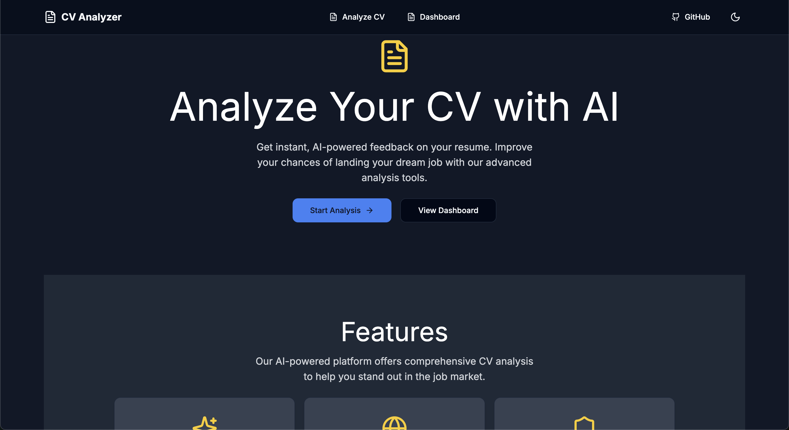
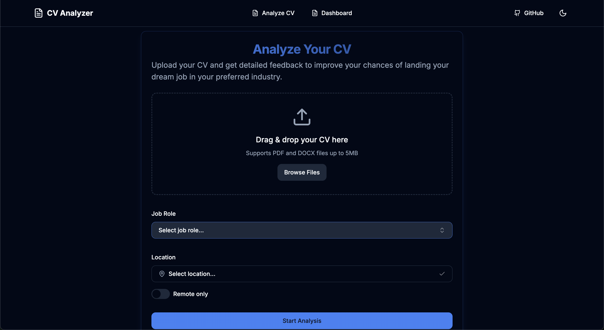
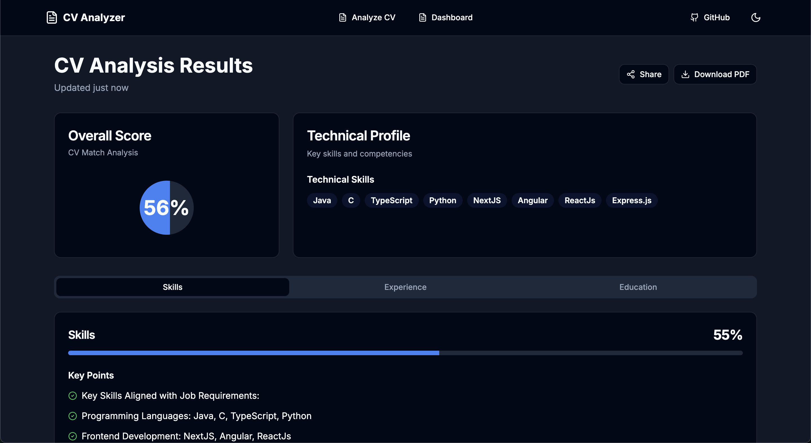

# Ai CV Analyzer

CV Analyzer is a web application built with Next.js that analyzes uploaded CVs, providing insights and recommendations to improve alignment with job roles. The application includes key features like ATS readiness analysis, scoring, and tailored improvement suggestions.





## Features

- **CV Upload & Analysis**: Easily upload your CV for analysis.
- **ATS Compatibility**: Analyze ATS readiness to ensure your CV meets applicant tracking standards.
- **Detailed Feedback**: Receive actionable insights on skills, experience, and education.
- **Score Overview**: View an overall score and breakdown by section.
- **Responsive Dashboard**: Access a mobile-friendly dashboard to view your CV insights.
- **Dark Mode**: Switch between light and dark themes for accessibility and comfort.

## Tech Stack

- **Frontend**: [Next.js](https://nextjs.org/), [Tailwind CSS](https://tailwindcss.com/)
- **LLM**: [Google Gemini API](https://ai.google.dev/gemini-api/docs/api-key),

## Getting Started

Follow these instructions to get a copy of the project up and running on your local machine.

### Prerequisites

Make sure you have the following installed:
- [Node.js](https://nodejs.org/) (version 14.x or later)
- [npm](https://www.npmjs.com/) or [yarn](https://yarnpkg.com/)

### Installation

1. **Clone the Repository**:
   ```bash
   git clone https://github.com/madhurajayashanka/Ai_CV_Analyse_NextJS.git
   cd Ai_CV_Analyse_NextJS
   ```

2. **Install Dependencies**:
   ```bash
   npm install
   # or
   yarn install
   ```

3. **Set Up Environment Variables**:
   - Create a `.env` file in the root of the project and add your API keys:
     ```env
     NEXT_PUBLIC_GEMINI_API_KEY=your_google_gemini_api_key
     ```

### Running the Application

To run the development server:

```bash
npm run dev
# or
yarn dev
```

Open [http://localhost:3000](http://localhost:3000) in your browser to view the application.

## Usage

1. **Analyze CV**: Upload a CV to receive a detailed analysis.
2. **View Dashboard**: Access the dashboard to see the analysis results, including scores and recommendations.
3. **Download PDF**: Save a PDF of the results for easy sharing or offline viewing.

## Contributing

We welcome contributions to improve this project. To contribute:

1. Fork the repository.
2. Create a new branch for your feature or bug fix (`git checkout -b feature-name`).
3. Commit your changes (`git commit -m 'Add some feature'`).
4. Push to the branch (`git push origin feature-name`).
5. Open a Pull Request.

